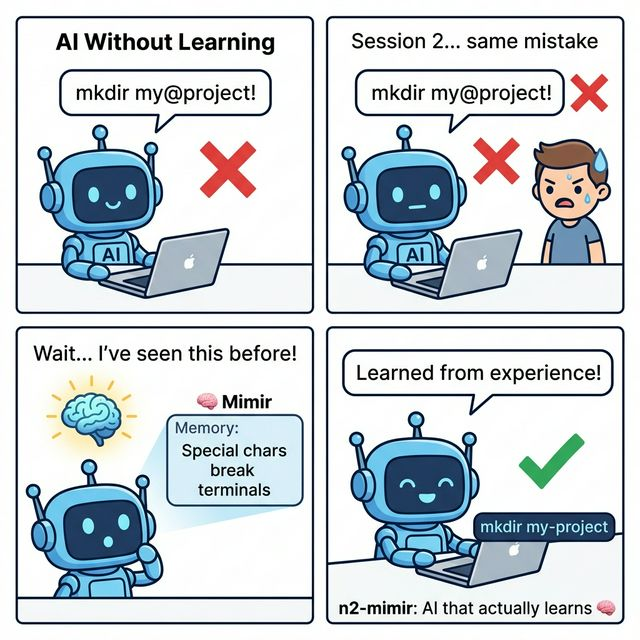
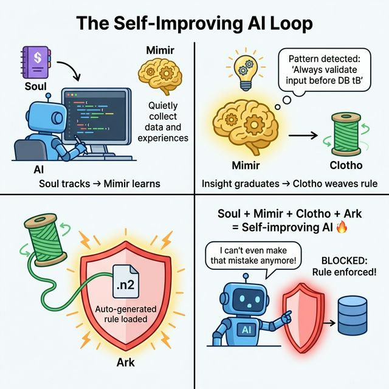

# 🧠 n2-mimir

[](https://www.npmjs.com/package/n2-mimir)
[](https://www.npmjs.com/package/n2-mimir)
[-blue.svg)](LICENSE)
[](https://nodejs.org)
[](https://www.typescriptlang.org/)
[](https://www.rust-lang.org/)
[](https://www.sqlite.org/)
[](https://nodejs.org/api/esm.html)
[](https://vitest.dev/)
[](https://github.com/choihyunsus/n2-mimir)

**[한국어](README.ko.md)** | English

> **AI Experience Learning Engine** — learns from experience, changes behavior. Named after the Norse guardian of wisdom. 🧠

## What is Mimir?

AI agents remember, but they don't learn. They make the same mistakes every session.

### 🧠 Mimir Standalone



### 🔗 Soul + Mimir + Clotho + Ark Synergy



Mimir breaks this loop:
```
Experience → [Analyze → Extract Patterns → Generate Insights] → Behavior Change
```

**Named after** the Norse guardian of wisdom. Odin sacrificed an eye for knowledge — AI pays with experience.

## Vision — Why This Matters

Traditional AI agent setup relies on massive rule documents (constitution files, system prompts) that consume thousands of tokens every session — and the AI may not even follow them.

```
Before (Token-heavy):
  📄 GEMINI.md (3000+ tokens) → AI reads at boot → may ignore → repeat every session
  📄 Rules scattered in prompts → AI forgets → user repeats same instructions

After (System-enforced, 0 tokens):
  🛡️ Ark    → Rules compiled to state machine. AI CAN'T bypass. No reading needed.
  🧵 Clotho → Proven insights auto-become rules. No manual writing needed.
  🧠 Mimir  → Experience recall at the right time. No repetition needed.
```

**Result**: AI constitution files become obsolete. The system enforces, learns, and adapts — not the AI reading a document.

## Ecosystem — Ark + Mimir + Clotho

These three systems form a self-reinforcing loop:

```
🛡️ Ark (Backbone)
  → State machine: tracks WORKING / IDLE / BOOTING
  → Rule enforcement: blocks violations, warns on soft rules
  → Context signal: Mimir uses WORKING state to filter noise

🧠 Mimir (Brain)
  → Experience collection: only during WORKING state
  → Insight generation: patterns from repeated experiences
  → Recall: inject relevant knowledge at the right time

🧵 Clotho (Automation)
  → Graduated insights → auto-generate .n2 rules
  → Rules loaded by Ark → system-level enforcement
  → Zero human intervention, zero tokens
```

```
The Loop:
  Ark tracks state → Mimir collects during WORKING
    → Mimir generates insights → insights graduate
      → Clotho creates .n2 rules → Ark loads them
        → Ark enforces new rules → repeat
```

**Self-improving system**: the more it works, the smarter it gets, the stricter it becomes — automatically.

### Why the full stack?

Each component works alone, but the synergy is exponential:

```
Mimir only        → "Experience storage works, but no auto-collection"
                     → You need Soul

+ Soul             → "Auto-collection works, but no rule enforcement"
                     → You need Ark

+ Ark              → "Rules are enforced, but I have to write them manually"
                     → You need Clotho

+ Clotho           → "Everything is automatic. It learns, enforces,
                      and improves itself — without me doing anything."
                     → n2-3.1-bw full package 🔥
```

## Architecture

```
┌─────────────────────────────────────┐
│            n2-mimir                 │
├──────────┬──────────────────────────┤
│ Rust Core│  TypeScript Brain        │
│ (napi-rs)│                          │
│          │  collector/ → normalizer │
│ SQLite   │  analyzer/  → patterns   │
│ FTS5     │  insight/   → generator  │
│ Vector   │  converter/ → overlay    │
│          │  tracker/   → scoring    │
│          │  orchestrator/ → recall  │
└──────────┴──────────────────────────┘
```

- **Rust Core**: SQLite, FTS5 full-text search, SIMD vector ops (performance)
- **TS Brain**: Pattern analysis, insight generation, token-budgeted overlay

### ⚠️ Rust Native — Node Version Compatibility

The pre-built `.node` binary is **tied to the Node.js ABI version** it was compiled with. If your Node version differs, the binary will **silently fail** (hang or crash), and Mimir will fall back to better-sqlite3.

| Built with | Works on | Status |
|------------|----------|:------:|
| Node v24 (modules v137) | Node v24.x | ✅ Native |
| Node v24 (modules v137) | Node v22/v20/v18 | ❌ Fallback |
| Node v22 (modules v131) | Node v22.x | ✅ Native |

**Check your status:**
```bash
node -e "const n = require('./lib/mimir/store/native.js'); console.log('Native:', n.isNativeAvailable())"
```

**Rebuild for your Node version** (requires Rust):
```bash
cd n2-mimir/packages/core
cargo build --release
# Copy .dll → .node (Windows)
copy target\release\n2_mimir_core.dll <soul_path>/lib/mimir/n2_mimir_core.win32-x64.node
```

> 💡 **No Rust? No problem.** Mimir automatically falls back to `better-sqlite3` (pure JS). All features work — just without SIMD vector acceleration (~15-20x slower on cosine similarity at 100K+ records).

## Soul Integration (How it works)

Mimir integrates into the Soul lifecycle as a native learning module:

```
┌─────────────────────────────────────────────────────┐
│  Boot (n2_boot)                                     │
│  → mimirActivate: project insights injection (500t) │
├─────────────────────────────────────────────────────┤
│  Work Start (n2_work_start)                         │
│  → mimirRecall: task-based experience recall (300t) │
├─────────────────────────────────────────────────────┤
│  Work End (n2_work_end)                             │
│  → mimirDigest: experience collection               │
│  → mergeInsights: duplicate consolidation            │
│  → insight generation + graduation                   │
├─────────────────────────────────────────────────────┤
│  Study (manual/auto learning)                       │
│  → study_start → study_add (repeat) → study_end    │
│  → Ark contract enforces sequence                    │
└─────────────────────────────────────────────────────┘
```

### MCP Tools

| Tool | Description |
|------|-------------|
| `n2_mimir_status` | DB stats (experiences, insights, tags) |
| `n2_mimir_insights` | List insights by status/importance |
| `n2_mimir_overlay` | Generate experience overlay for topic |
| `n2_mimir_study_start` | Start study session (topic + source) |
| `n2_mimir_study_add` | Add learning entry (repeatable) |
| `n2_mimir_study_end` | End study → save + digest + merge |

### Ark Contract

`mimir-study-workflow.n2` enforces study sequence:
```
IDLE → STUDYING : on n2_mimir_study_start
STUDYING → STUDYING : on n2_mimir_study_add
STUDYING → IDLE : on n2_mimir_study_end
```

## Learning Lifecycle

Mimir's learning follows the same path as human expertise:

```
Experience Collection
  → Pattern Detection
    → Insight Generation
      → Voting + Merging
        → Graduation
          → Ark Enforcement ← Clotho
```

### Real World Example — "How Rose Learned to Follow Boot Order"

This is a real case from Mimir's first week of operation:

```
Day 1:  Rose skips n2_coding() after boot
        → User corrects → Mimir records correction experience

Day 2:  Rose skips again
        → Mimir records another correction → detects pattern
        → Generates insight: "MUST call n2_coding after n2_boot"
        → importance: 2

Day 3-5: Rose keeps forgetting
        → Each correction = upvote on existing insight
        → importance climbs: 2 → 6 → 12 → 20 → 34

Day 6+: importance 34 = top priority insight
        → Injected as ⚠️ warning at every boot
        → Rose stops forgetting
        → Boot order is now muscle memory ✅
```

```
Before Mimir:  📄 "Don't forget n2_coding" written in rules doc
               → AI reads 3000 tokens → may still ignore → repeat

After Mimir:   🧠 AI experienced consequences 10+ times
               → Pattern auto-detected → importance 34
               → 5 tokens injected at boot → never forgets
               → Eventually graduates → Ark blocks violations (0 tokens)
```

**Same thing happens with humans**: make a mistake → get corrected → repeat → eventually it's habit. Mimir automates this for AI.

### Clotho — Auto Rule Generation

When an insight **graduates** (importance ≥ 7, verified multiple times), Clotho automatically generates Ark `.n2` contracts:

```
📖 Insight (graduated):
  "Boot order: n2_boot → n2_coding → n2_work_start. Never skip."
  importance: 7, status: graduated

  ↓ Clotho auto-generates ↓

📜 Ark Contract (.n2):
  @rule BootOrder {
    match n2_work_start {
      require: state.BootSequence == "READY"
      message: "Call n2_coding first"
    }
  }

  → System-level enforcement. AI cannot bypass.
```

**Human analogy**: "I've made this mistake 5 times → let's make it a team rule → system blocks violations."

### Data Verification — 3-Source Consensus

Learning data from external sources requires cross-validation:

```
  1 source  → unverified  (confidence: 0.3)
  2 sources → pending     (confidence: 0.6)
  3 sources → verified    (confidence: 0.9) ✅
  
  Conflict detected → flagged for user review
  User feedback     → final verification (confidence: 1.0)
```

## Memory Retrieval — How AI Accesses 100K+ Experiences

AI never sees all data. It sees only what matters, when it matters:

```
Boot (automatic, every session):
  → Top insights by importance (500t budget)
  → Same 5-10 lines whether DB has 100 or 100,000 experiences

Work Start (automatic, per task):
  → FTS5 search by task keywords (300t budget)
  → "image generation" task → recalls ComfyUI experiences

Manual Query (on demand):
  → n2_mimir_overlay(topic) → natural language recall
  → "kimchi stew recipe" → all related experiences surface

Everything else:
  → Sleeps in DB → wakes up only when searched
```

**Result**: 100K experiences, 500 tokens at boot. Constant cost regardless of DB size.

## Token Cost

| Phase | LLM Tokens | Notes |
|-------|-----------|-------|
| ACTIVATE (boot) | ~500 | Overlay injection only. DB queries are free (local SQLite) |
| RECALL (work_start) | ~300 | Task-based experience recall |
| DIGEST (work_end) | 0 | Template-based, no LLM needed |
| DIGEST + LLM | ~1000-2000 | Optional LLM analysis via local Ollama |

**All DB operations (search, tag, vote, score) = 0 tokens.** Runs entirely on local SQLite.

**Search engine**: SQLite FTS5 with **BM25 ranking** (built-in, no external service).

## Scalability — Designed for 100K+

All components are designed to scale to 100,000+ experiences without degradation:

| Component | 100K behavior | Safeguard |
|-----------|--------------|-----------|
| **SQLite** | Handles millions of rows | Standard DB, battle-tested |
| **FTS5 search** | BM25 indexed, <10ms at 100K | Built-in SQLite extension |
| **Boot overlay** | Queries top 50 insights only | Token budget (500t) auto-cuts |
| **Digest** | Processes recent session only | Not full-table scan |
| **mergeInsights** | Category-scoped comparison | O(n) per category, not O(n²) total |
| **Clotho rules** | 7 per category cap | Max ~49 rules total |
| **Tags** | Indexed, deduped by FTS5 | No memory-resident cache |
| **Recall** | FTS5 → Tags → Category cascade | Early exit on budget hit |

```
At 100,000 experiences:
  Boot time:   ~50ms (query 50 insights, not 100K experiences)
  Recall time: ~10ms (FTS5 indexed search)
  Digest time: ~100ms (session-scoped, not full DB)
  Disk:        ~50MB SQLite file (compact binary format)
  Memory:      ~5MB runtime (no full-table loads)
```

**Same principle as Arachne**: Arachne assembles context from 5MB+ codebases within token budgets. Mimir does the same for 50MB+ experience databases. The pattern is proven — never read everything, always extract only what matters.

## Search Architecture — Mimir × Arachne Pipeline

Mimir and Arachne operate at different layers. Mimir **finds**, Arachne **compresses**.

```
┌──────────────────────────────────────────────────────┐
│  Layer 1: Search Engine (Mimir)                      │
│  ─────────────────────────────────────               │
│  Query → FTS5 (keyword) + Vector (semantic)          │
│        → BM25 ranking + cosine similarity            │
│        → Candidates: top 50 experiences              │
│                                                      │
│  Tech: SQLite FTS5, Ollama nomic-embed-text          │
│  Speed: <10ms at 100K rows (indexed)                 │
│  Scale: millions of rows (SQLite proven)             │
├──────────────────────────────────────────────────────┤
│  Layer 2: Context Compression (Arachne)              │
│  ─────────────────────────────────────               │
│  50 candidates → relevance scoring                   │
│               → token budget fitting (300~500t)      │
│               → compressed overlay assembly          │
│                                                      │
│  Role: fits search results into AI context window    │
│  Same pattern as codebase context assembly           │
├──────────────────────────────────────────────────────┤
│  Layer 3: Injection (Soul)                           │
│  ─────────────────────────────────────               │
│  Compressed overlay → system prompt injection        │
│                     → AI sees 5-10 lines, not 100K   │
│                                                      │
│  Budget: boot=500t, recall=300t, manual=configurable │
└──────────────────────────────────────────────────────┘
```

### Role Separation

| System | Role | Analogy |
|--------|------|---------|
| **Mimir** | Librarian — finds relevant books from millions | Search engine |
| **Arachne** | Note-taker — summarizes findings within page limit | Context compressor |
| **Soul** | Reader — receives the summary, acts on it | Consumer |

### Why This Matters at Scale

```
At 1,000 experiences:   Mimir alone is enough (FTS5 handles it trivially)
At 10,000 experiences:  Mimir + Arachne ensures constant token cost
At 100,000 experiences: Same architecture, same boot time (~50ms)
At 1,000,000+:          Consider Phase 5 (vector DB separation)
```

### Future Scale Path (Phase 5+)

When SQLite FTS5 reaches practical limits (1M+ with heavy concurrent writes):

| Option | When | Migration |
|--------|------|-----------|
| **SQLite + WAL mode** | 100K~500K | Config change only |
| **Vector DB separation** (ChromaDB/Qdrant) | 500K~1M | Embeddings to external, FTS5 stays |
| **Sharded SQLite** | 1M+ | Per-project DB files |

> Current architecture is designed for this migration path. The FTS5 + vector search abstraction makes the storage backend swappable without changing the API surface.

## Backup

Mimir data is cumulative (experiences only grow). Monthly backup is sufficient:

```
What:   soul/data/mimir.db (single SQLite file)
When:   Monthly (data grows slowly, not volatile)
How:    n2_mimir_backup tool → file copy
Where:  n2-mimir/backups/YYYY-MM/mimir.db
```

## Roadmap

### Phase 1 — Core Engine ✅
> SQLite + FTS5 experience learning

- [x] SQLite + FTS5 experience storage
- [x] Keyword-based pattern detection (KR/EN)
- [x] Cascading recall (FTS5 → Tags → Category → Project)
- [x] Token-budgeted overlay assembly (70/30 split)
- [x] Insight voting + graduation system
- [x] Effect tracking + scoring
- [x] Delta learning (duplicate experience prevention)
- [x] Insight merging (similar insight consolidation)
- [x] Rust core NAPI binary (win32-x64)

### Phase 2 — Soul Integration ✅
> Native integration into Soul lifecycle

- [x] `mimirActivate()` — project-based insight injection at `n2_boot` (500t)
- [x] `mimirRecall()` — task-based experience recall at `n2_work_start` (300t)
- [x] `mimirDigest()` — experience collection at `n2_work_end`
- [x] `mergeInsights()` — post-digest duplicate consolidation (236t → 125t, -47%)
- [x] Study workflow — `study_start` → `study_add` → `study_end`
- [x] Ark contract — `mimir-study-workflow.n2` enforces study sequence
- [x] Clotho — graduated insights → auto `.n2` rule generation (0 tokens)
- [x] Semantic search — Ollama `nomic-embed-text` cosine similarity recall
- [x] Full cycle verified: boot → work → end → reboot (insights persist)

### Verified Stats (2026-03-24)

```
DB: 89 experiences, 16 insights, 852 tags
Boot overlay: ~125 tokens (auto-optimized by merging)
Ark contracts: 8 loaded (including StudyWorkflow)
Rust native: ✅ 21 exports (win32-x64, Node v24, Rust 1.94)
Ollama: nomic-embed-text (127.0.0.1:11434) — semantic search active
Full cycle: boot → work_start → work_end → reboot ✅
Study cycle: study_start → study_add ×3 → study_end ✅
Auto Study: search 10 → crawl 5 → claims 56 → verified 4 (93% filter rate) ✅
Merge effect: 236t → 174t → 125t (progressive dedup)
```

### Code Health (2026-03-24 Deep Audit)

```
Source files: 42 TypeScript (all under 500-line limit)
Test suite:   119 tests (11 test files) — 95 unit + 24 simulation
Type check:   tsc --noEmit 0 errors
Build:        ESM 80KB + CJS 81KB (tsup, dual format)
Bundle:       CJS require() ✅ | ESM import() ✅ | :memory: DB ✅

Refactoring (v2.0.7):
  database.ts:  713 → 239 lines (FallbackStore extracted: 339 lines)
  cosineSimilarity: 3 duplicates → 1 shared util (utils/math.ts)
  console.error: 2 removed (library should not pollute consumer logs)
  skeleton exports: toArkRule/toClothoWorkflow removed from barrel
  soul-plugin: ../src/ → 'n2-mimir' package import (npm-safe)
  Korean comments: unified to English (international distribution)
```

### Phase 3 — Advanced ✅
> All moved to Phase 4 or completed

- [x] Semantic search — Ollama `nomic-embed-text` (Phase 2)
- [x] Clotho auto-rules — graduated insights → .n2 (Phase 2)
- [x] Data verification → moved to Phase 4 (with auto-study)
- [x] QLN real-time detection → on hold
- [x] LLM analysis → moved to Phase 4 (with Ollama pipeline)
- [x] Distribution → separate timeline (n2-3.1-bw)

### Phase 4 — Auto Study ✅
> Fully automated web learning pipeline. Zero external dependencies.

```
n2_mimir_auto_study(topic)
  → DuckDuckGo HTML (built-in) → search      → 0 tokens, 0 API keys
  → Node.js fetch + cheerio    → crawl       → 0 tokens
  → Pattern-based extraction   → extract     → 0 tokens (no LLM required)
  → 5-source cross-validation  → verify      → 0 tokens
  → Contradiction detection    → flag/reject → 0 tokens
  → Mimir DB (verified only)   → store       → 0 tokens
```

- [x] Built-in search engine (DuckDuckGo HTML parsing, no SearXNG/API key needed)
- [x] Page crawler + text extractor (semantic HTML: article > main > body)
- [x] Pattern-based fact extraction (keyword scoring, noise filtering)
- [x] 5-source cross-validation (3/5+ agreement = verified, 93% filter rate)
- [x] Contradiction detection (negation pattern matching)
- [x] `n2_mimir_auto_study` MCP tool
- [ ] Optional: Ollama LLM enhancement (deeper analysis when available)

#### Design Decisions

| Decision | Reason |
|----------|--------|
| DuckDuckGo over SearXNG | SearXNG = AGPL-3.0 (license contamination). DDG HTML = no license issue |
| 5-source over 3-source | System cost is 0, more sources = less contaminated data |
| Pattern extraction over LLM | Zero dependency. Works without Ollama/OpenAI. LLM is optional enhancement |
| Built-in over external | "All projects are for distribution" — must work standalone |

#### First Test Results (2026-03-24)

```
Test 1: "YouTube Shorts automation API" (technical topic)
  Search:    10 results (3-month filter, cascading)
  Crawl:     5 pages fetched + cleaned
  Extract:   56 claims identified
  Verified:  1 fact (3+ sources agree)
  Pending:   3 facts (2 sources agree)
  Rejected:  35 facts (insufficient evidence)
  Saved:     4 experiences to Mimir DB
  Filter:    93% rejection rate

Test 2: "Gundam model painting techniques" (hobby/general topic)
  Search:    10 results
  Crawl:     3 pages (2 blocked by bot protection)
  Extract:   45 claims identified
  Verified:  0 facts
  Pending:   1 fact
  Rejected:  38 facts
  Saved:     1 experience to Mimir DB
  Filter:    98% rejection rate ← keyword matching limitation
```

#### Keyword vs Semantic Verification

The verification engine uses **keyword overlap** to cluster similar claims. This works well for **standardized terminology** (tech docs), but struggles with **diverse expressions** (general knowledge).

```
Keyword matching (current default):
  Source 1: "에어브러시로 도색한다"
  Source 2: "airbrush painting technique"
  Source 3: "스프레이로 칠한다"
  → Keyword overlap: 0% → all treated as different claims ❌
  → Actual meaning: all the same

Semantic matching (Ollama enhancement):
  Source 1: [0.82, 0.15, 0.73, ...]  ← vector embedding
  Source 2: [0.80, 0.17, 0.71, ...]
  Source 3: [0.79, 0.14, 0.69, ...]
  → Cosine similarity: 0.92 → clustered as same claim ✅
```

| Domain | Keyword Only | + Semantic (Ollama) |
|--------|-------------|---------------------|
| **Tech docs** (React, API) | ✅ Good (terms standardized) | ✅ Same |
| **Multi-language** (KR+EN) | ❌ 0% match | ✅ Meaning-based |
| **Hobby/General** (Gundam, cooking) | ❌ Low (diverse expressions) | ✅ High |
| **News/Current events** | ⚠️ Medium | ✅ High |

#### A/B Test: Keyword vs Semantic (2026-03-24)

Same topic, same search results — only verification mode changed:

```
Topic: "Gundam model painting techniques" (hobby/general)

                 Keyword Only    Semantic Hybrid    Δ
Search results:  10              10                 —
Pages crawled:   3               4                  +1
Claims extracted:45              55                 +10
Verified (3+):   0               1                  +1 🔥 (from nothing!)
Pending (2):     1               1                  —
Rejected:        38              34                 -4 (rescued)
Saved to DB:     1               2                  +100% 🔥
Rejection rate:  98%             93%                -5%
```

> **Conclusion**: For general/hobby topics, semantic hybrid mode **doubles** the saved experiences by understanding that diverse expressions like "airbrush painting" ≈ "spray painting" are the same claim, even across languages. For tech docs, the difference is minimal since terminology is already standardized.

#### Token Cost Comparison

| Mode | Cloud Tokens | Local Cost | Requirement |
|------|-------------|------------|-------------|
| **Keyword only** (default) | ~20t (tool call) | 0 | Nothing (built-in) |
| **+ Ollama semantic** | ~20t (tool call) | ~50ms per claim | Ollama + nomic-embed-text |
| **+ Ollama LLM analysis** | ~20t (tool call) | ~2s per page | Ollama + any chat model |

> **Design principle**: keyword-only is the baseline (works standalone, 0 cost). Ollama adds intelligence when available, but is never required. Cloud AI tokens are only spent on the initial MCP tool call (~20t), the entire pipeline runs server-side at zero token cost.

## 📦 Installation

> 💡 **Pro tip**: Just ask your AI agent: *"Install n2-mimir for me."* It knows what to do. 🧠

```bash
npm install n2-mimir
```

Works with both **ESM** and **CJS**:
```typescript
// ESM
import { Mimir } from 'n2-mimir';

// CJS
const { Mimir } = require('n2-mimir');
```

> **Requirements**: Node.js >= 20 + `better-sqlite3` (peer dependency, needs C++ build tools).
> If install fails, see the error message for platform-specific instructions.

### MCP Config (Claude Desktop / Cursor / etc.)

Mimir integrates via Soul — no separate MCP server needed:

```json
{
  "mcpServers": {
    "n2-soul": {
      "command": "node",
      "args": ["/path/to/n2-soul/index.js"]
    }
  }
}
```

> Mimir is loaded automatically by Soul at boot. Configure in `soul/lib/config.js`.

## 🔧 Configuration

Create or update `config.local.js` in the Soul directory:

```javascript
module.exports = {
    MIMIR: {
        tokenBudget: 500,          // Max tokens for experience overlay
        halfLife: 14,              // Importance decay half-life (days)

        // Enable semantic search (requires Ollama)
        llm: {
            provider: 'ollama',
            model: 'nomic-embed-text',
            endpoint: 'http://localhost:11434',
        },
    },
};
```

## Quick Start

### Standalone (No Soul Required)

```typescript
import { Mimir } from 'n2-mimir';

const mimir = new Mimir({ dbPath: './mimir.db' });

// Add experience — agent/project are optional (default: 'default')
mimir.addExperience({
  type: 'correction',
  category: 'workflow',
  context: 'Terminal work',
  action: 'Used special character in directory name',
  outcome: 'Terminal commands all hung',
  correction: 'Use only [a-z0-9-] for directory names',
});

// Or specify agent/project for multi-agent setups
mimir.addExperience({
  agent: 'rose',
  project: 'my-project',
  type: 'success',
  category: 'coding',
  context: 'React optimization',
  action: 'Used React.memo on list items',
  outcome: 'Render time reduced by 60%',
});

// Recall relevant experiences
const result = mimir.recall('directory naming');

// Get overlay for prompt injection (500t budget)
const overlay = mimir.overlay('directory naming');

// Auto Study: learn from the web (0 API keys needed)
const study = await mimir.autoStudy('React Server Components');
console.log(`Learned ${study.factsVerified} verified facts`);

// Run digest to analyze patterns and generate insights
await mimir.digest({ project: 'default' });

mimir.close();
```

### With Soul Integration

```typescript
// Mimir is loaded automatically by Soul at boot.
// Configure in soul/lib/config.js — no extra code needed.
```

## 📚 API Reference

### Experience Collection

| Method | Description |
|--------|-------------|
| `addExperience(input)` | Add experience + auto-tag + embedding |
| `addRawExperience(raw)` | Add raw experience (auto-normalized) |
| `queryExperiences(filter)` | Query by project/agent/category/type |
| `deltaLearn(input)` | Upsert: existing → frequency++, new → insert |

### Recall & Overlay

| Method | Description |
|--------|-------------|
| `recall(topic, project?, agent?)` | FTS5 + tag + semantic search |
| `recallAsync(topic, project?, agent?)` | + Ollama cosine similarity |
| `overlay(topic, project?, agent?)` | recall + assemble → prompt injection text |

### Digest & Insights

| Method | Description |
|--------|-------------|
| `digest({ project, agent? })` | Collect → analyze → generate insights |
| `queryInsights(filter)` | Query insights by status/importance |
| `getGraduatedInsights()` | Get insights ready for rule conversion |
| `upvoteInsight(id)` / `downvoteInsight(id)` | Vote on insight importance |

### Auto Study (Web Learning)

| Method | Description |
|--------|-------------|
| `autoStudy(topic, config?)` | Search → crawl → extract → cross-validate → store |

### Tag Similarity

| Method | Description |
|--------|-------------|
| `confirmTagSimilarity(tagA, tagB)` | Record user-confirmed equivalence |
| `findSimilarTags(tag, autoOnly?)` | Find similar tags (confidence-based) |

### Utility

| Method | Description |
|--------|-------------|
| `getStats()` | `{ experiences, insights, tags }` |
| `close()` | Close database |

## 🚀 MCP Tools

Mimir registers these tools via Soul:

| Tool | Description |
|------|-------------|
| `n2_mimir_status` | Show experience/insight/tag statistics |
| `n2_mimir_overlay` | Generate experience overlay for prompt injection |
| `n2_mimir_insights` | List learned insights with importance/status scores |
| `n2_mimir_study_start` | Start a manual study session |
| `n2_mimir_study_add` | Add a learning entry during study |
| `n2_mimir_study_end` | End study session, save experiences + generate insights |
| `n2_mimir_auto_study` | Automated learning: search → crawl → verify → store |
| `n2_mimir_backup` | Backup Mimir DB to external path |

### Example: Auto Study

```
n2_mimir_auto_study(topic: "React Server Components")

📖 Auto Study complete: "React Server Components"
  🔧 Mode: 🧠 hybrid (keyword+semantic)
  🔍 Search results: 10
  📄 Pages crawled: 5
  📝 Claims extracted: 56
  ✅ Verified facts (3+ sources): 4
  💾 Experiences saved: 4
```

> One tool call (~20 tokens). The entire pipeline runs server-side at zero token cost.

## 🌐 N2 Ecosystem — Better Together

| Package | Role | npm | Standalone |
|---------|------|-----|:----------:|
| **QLN** | Tool routing (1000+ tools → 1 router) | `n2-qln` | ✅ |
| **Soul** | Agent memory & session management | `n2-soul` | ✅ |
| **Ark** | Security policies & code verification | `n2-ark` | ✅ |
| **Arachne** | Code context auto-assembly | `n2-arachne` | ✅ |
| **Mimir** | Experience learning engine 🧠 | `n2-mimir` | ✅ |
| **Clotho** | Auto rule generation from insights 🧵 | `n2-clotho` | ✅ |

> Every package works **100% standalone**. But when combined, magic happens.

### 🔗 Synergy: The Self-Improving Loop

```
User works with AI
     │
     ▼
┌─── Soul (Memory) ──────────────────────────────────┐
│ Tracks sessions, handoffs, decisions               │
│ → Triggers Mimir at work_start (recall)            │
│ → Triggers Mimir at work_end (digest)              │
└────────────────┬───────────────────────────────────┘
                 │
                 ▼
┌─── Mimir (Learning) ───────────────────────────────┐
│ Collects experiences → generates insights          │
│ → Insights graduate at importance 30+              │
│ → Graduated insights → Clotho                      │
└────────────────┬───────────────────────────────────┘
                 │
                 ▼
┌─── Clotho (Auto-Rules) ────────────────────────────┐
│ Graduated insights → .n2 rule files (0 tokens)     │
│ → Rules loaded by Ark at boot                      │
└────────────────┬───────────────────────────────────┘
                 │
                 ▼
┌─── Ark (Enforcement) ──────────────────────────────┐
│ State machine: compiles .n2 → blocks violations    │
│ → System-level enforcement, AI can't bypass        │
│ → Loop repeats: more work → smarter rules          │
└────────────────────────────────────────────────────┘
```

### 🕸️ Arachne + Mimir: Code × Experience

Arachne finds the right code. Mimir recalls past experience. Together, AI gets both **context** and **wisdom**.

```
User: "Fix the database timeout bug"
     │
     ├──→ 🕸️ Arachne                    🧠 Mimir
     │    "Here are the 4 relevant        "Last time you fixed a timeout,
     │     files from 3,219 in your        you increased the pool size
     │     project (30K tokens)"           from 5 to 20. That worked."
     │         │                                │
     └─────────┴────────────────────────────────┘
                        │
                        ▼
               AI generates precise fix
               with historical context ✅
```

| Without Mimir | With Mimir |
|---------------|------------|
| AI sees the code but doesn't know what was tried before | AI sees code + past attempts |
| May repeat a fix that already failed | Avoids known-bad approaches |
| No learning across sessions | Learns and improves every session |

> 💡 **Setup**: Both are loaded via Soul. No extra config needed — they auto-detect each other.

## Changelog

### v2.0.7 (2026-03-24) — Deep Audit + Production Hardening
- **database.ts refactoring**: 713 → 239 lines + `database-fallback.ts` (339 lines)
- **cosineSimilarity dedup**: 3 redundant copies → `utils/math.ts` single source
- **console.error removed**: 2 occurrences in engine.ts/crawler.ts (library hygiene)
- **skeleton export cleanup**: `toArkRule`, `toClothoWorkflow` removed from barrel (Phase 4 stubs)
- **soul-plugin import fix**: `../src/` → `n2-mimir` package import (npm consumer safe)
- **Korean comment unification**: embedder.ts, search.ts → English (international distribution)
- **assemble export**: added to package barrel for external consumer access
- **119 tests**: 95 unit + 24 simulation (E2E pipeline, FallbackStore, cosine util, bundle integrity)

### v2.0.5 (2026-03-24) — General-Purpose Distribution
- **ESM + CJS dual export**: works with both `import` and `require`
- **agent/project optional**: defaults to `'default'` — standalone use without Soul concepts
- **better-sqlite3 error guide**: platform-specific install instructions on load failure
- **search/ TypeScript port**: 7 CJS files → TS + barrel export (800+ lines)
- **createRequire ESM-CJS interop**: fixes `Dynamic require` crash in ESM runtime
- **MimirLike interface**: avoids circular import between Mimir class and search module
- **Embedder DI**: `verifier.ts` global state → function parameter injection
- **Full API Reference**: added to README for standalone users

### v2.0.4 (2026-03-24) — Rust Native Rebuild + Code Refactoring
- **Rust NAPI rebuild**: recompiled for Node v24 (modules v137) + Rust 1.94
- **21 native exports**: `openDatabase`, `insertExperience`, `cosineSimilarity`, `findExperiencesByTags`, etc.
- **native.js path fix**: loader now searches parent directory (`lib/mimir/`) for `.node` binary
- **tools/mimir.js refactoring**: 737 lines → 4 files (290+93+79+230), all under 500-line limit
- **Real cosine similarity in recall**: replaced fake semantic search with actual vector computation
- **Encapsulation fix**: `mergeInsights` uses public API instead of `mimir.db` direct access
- **embedBatch concurrency limit**: max 3 concurrent Ollama requests (prevents server overload)
- **Auto Study hardcoding removed**: dynamic `study-{topic}` project naming
- **Clotho change detection**: content-based comparison instead of rule count
- **UUID improvement**: `crypto.randomUUID()` replaces `Math.random()`
- **Embedder cache**: `embedSync()` method for synchronous vector lookup during recall

### v2.0.3 (2026-03-24) — Auto Study + Semantic Hybrid
- **Auto Study pipeline**: DuckDuckGo search → crawl → extract → 5-source verify → store
- **Semantic hybrid verification**: Ollama cosine similarity fallback for cross-language clustering
- **Cascading date filter**: 3m → 6m → 1y auto-expansion for temporal relevance
- **Built-in search engine**: DuckDuckGo HTML parsing (no API key, MIT clean)
- **5-source cross-validation**: keyword + semantic clustering + source diversity scoring
- **Contradiction detection**: negation pattern matching across claims
- **A/B test result**: semantic mode doubles saved experiences for general topics (1→2)
- **`n2_mimir_auto_study` MCP tool**: one-command learning from any topic

### v2.0.2 (2026-03-24) — Soul Integration + Clotho
- **mimirActivate**: project-based insight injection at boot (500t budget)
- **mimirRecall**: task-based experience recall at work_start (300t budget)
- **mimirDigest**: auto experience collection + insight generation at work_end
- **mergeInsights**: auto-merge similar insights (30% keyword overlap, 47% token savings)
- **Study workflow**: study_start/add/end 3-step learning + Ark contract enforcement
- **Clotho**: graduated insights → .n2 rule file auto-generation (0 tokens)

### v2.0.1 (2026-03-23) — Core Engine
- Core engine: SQLite + FTS5 + delta learning
- Insight voting + graduation + effect tracking
- Cascading recall (FTS5 → Tags → Category → Project)
- Rust NAPI binary (win32-x64)
- Soul CJS build + better-sqlite3 fallback

## 📄 License

This project is **dual-licensed**:

| Use Case | License | Cost |
|----------|---------|------|
| Personal / Educational | Apache 2.0 | **Free** |
| Open-source (non-commercial) | Apache 2.0 | **Free** |
| Commercial / Enterprise | Commercial License | [Contact us](mailto:lagi0730@gmail.com) |

See [LICENSE](./LICENSE) for full details.

## 💖 Support This Project

If Mimir helps your AI work smarter, consider supporting development:

[](https://github.com/sponsors/choihyunsus)
[](https://buymeacoffee.com/nton2)

> After all this, don't I deserve at least a cup of coffee? ☕

## ⭐ Star History

If you find Mimir useful, please give it a star! It helps others discover it.

---

🌐 [nton2.com](https://nton2.com) · 📦 [npm](https://www.npmjs.com/package/n2-mimir) · 📧 lagi0730@gmail.com

*Mimir — the guardian of wisdom. Your AI, learning from experience.* 🧠
